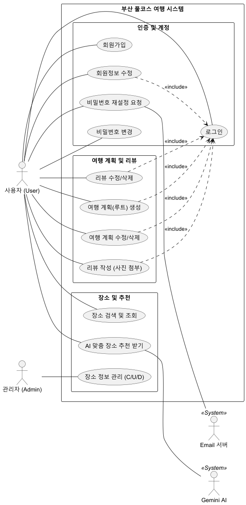
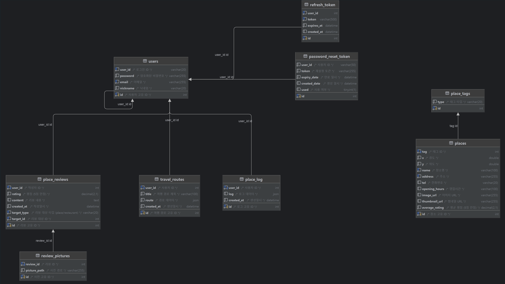
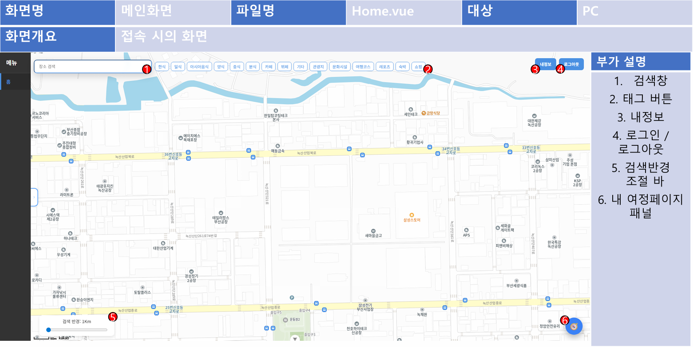
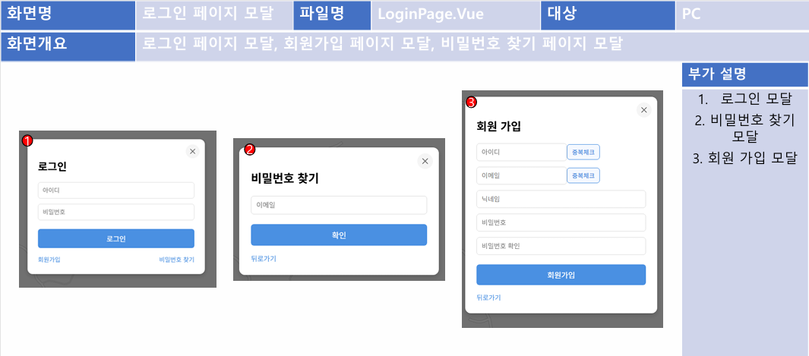
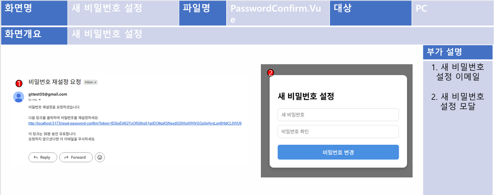

# 요구사항 명세서

## 1. 회원 및 인증 관리 (Auth & User)

| **ID** | **요구사항 명칭** | **상세 내용** | **관련 소스** |
| --- | --- | --- | --- |
| **REQ-101** | 회원가입 | 사용자는 아이디, 비밀번호, 이름, 이메일을 입력하여 회원으로 가입할 수 있어야 한다. | `AuthController`, `User.java` |
| **REQ-102** | 로그인 및 토큰 발급 | 아이디와 비밀번호로 인증하며, 성공 시 JWT(Access/Refresh) 토큰을 발급해야 한다. | `AuthController`, `JwtUtil` |
| **REQ-103** | 아이디/이메일 중복 체크 | 가입 전 사용 중인 아이디 또는 이메일인지 실시간으로 확인할 수 있어야 한다. | `AuthController` |
| **REQ-104** | 비밀번호 재설정 | 이메일 인증 토큰을 통해 분실한 비밀번호를 안전하게 재설정할 수 있어야 한다. | `PasswordResetController` |
| **REQ-105** | 토큰 자동 갱신 | Access Token 만료 시 Refresh Token을 이용하여 무중단 서비스를 제공해야 한다. | `AuthController`, `RefreshTokenService` |

## 2. 장소 정보 및 검색 (Place)

| **ID** | **요구사항 명칭** | **상세 내용** | **관련 소스** |
| --- | --- | --- | --- |
| **REQ-201** | 위치 기반 장소 조회 | 위도(x), 경도(y), 반경(dist)을 입력하여 주변 관광지 정보를 리스트로 반환해야 한다. | `PlaceController`, `PlaceService` |
| **REQ-202** | 카테고리 필터 검색 | 관광지, 음식점 등 특정 태그(tag)를 선택하여 원하는 유형의 장소만 필터링할 수 있어야 한다. | `PlaceController` |
| **REQ-203** | 통합 키워드 검색 | 검색어와 위치 정보를 조합하여 장소를 검색하고, 로그인 유저는 검색 이력을 남겨야 한다. | `PlaceController`, `PlaceLogMapper` |
| **REQ-204** | 장소 상세 정보 제공 | 장소의 주소, 연락처, 평균 평점, 이미지 등 세부 데이터를 제공해야 한다. | `PlaceController`, `Place.java` |

## 3. AI 맞춤 추천 (AI Recommendation)

| **ID** | **요구사항 명칭** | **상세 내용** | **관련 소스** |
| --- | --- | --- | --- |
| **REQ-301** | 개인화 장소 추천 | 사용자의 검색 로그와 현재 위치를 기반으로 Gemini AI가 최적의 장소 5곳을 추천해야 한다. | `RecommendationController`, `GeminiService` |
| **REQ-302** | 상황별 추천 필터 | 특정 태그나 거리 제한 조건 내에서 AI 추천이 이루어질 수 있도록 파라미터를 지원해야 한다. | `RecommendationService` |

## 4. 여행 코스 계획 (Travel Plan)

| **ID** | **요구사항 명칭** | **상세 내용** | **관련 소스** |
| --- | --- | --- | --- |
| **REQ-401** | 나만의 코스 생성 | 사용자는 여러 장소를 순서대로 담아 여행 경로(Route)를 생성하고 저장할 수 있어야 한다. | `TravelController`, `TravelRoute.java` |
| **REQ-402** | 여행 계획 관리 | 본인이 작성한 여행 계획에 대해 조회, 수정, 삭제(CRUD)가 가능해야 한다. | `TravelController`, `TravelService` |

## 5. 리뷰 및 커뮤니티 (Review)

| **ID** | **요구사항 명칭** | **상세 내용** | **관련 소스** |
| --- | --- | --- | --- |
| **REQ-501** | 멀티미디어 리뷰 작성 | 장소에 대해 별점, 텍스트 후기와 함께 여러 장의 사진을 업로드할 수 있어야 한다. | `ReviewController`, `ReviewService` |
| **REQ-502** | 대상별 리뷰 조회 | 장소 ID 또는 여행 계획 ID를 기준으로 등록된 모든 리뷰 리스트를 불러올 수 있어야 한다. | `ReviewController` |
| **REQ-503** | 장소 평점 자동 업데이트 | 리뷰 등록 및 수정 시 해당 장소의 평균 평점이 자동으로 계산되어 반영되어야 한다. | `PlaceService`, `PlaceController` |

## 6. 비기능 요구사항 (Non-Functional)

| **ID** | **분류** | **요구사항 내용** | **관련 소스** |
| --- | --- | --- | --- |
| **NREQ-601** | 보안 | 모든 API 요청은 `JwtAuthenticationFilter`를 통해 인가된 사용자만 접근을 허용해야 한다. | `SecurityConfig`, `JwtFilter` |
| **NREQ-602** | 예외 처리 | 시스템 오류 발생 시 `GlobalExceptionHandler`를 통해 일관된 에러 응답을 반환해야 한다. | `GlobalExceptionHandler` |
| **NREQ-603** | 성능 | 외부 AI 연동 및 대용량 장소 데이터 조회 시 MyBatis 매퍼를 통해 쿼리를 최적화해야 한다. | `PlaceMapper.xml` |

# 유스케이스 다이어그램

# 클래스 다이어그램

# ER 다이어그램

# 화면설계서

# REST API 명세서

## 1. 인증 (Auth)

**Base Path:** `/api/v1/auth`

| **기능** | **Method** | **Path** | **파라미터 / 바디** | **설명** |
| --- | --- | --- | --- | --- |
| 로그인 | `POST` | `/login` | `User` (JSON) | 아이디/비밀번호로 로그인하고 토큰을 발급받습니다. |
| Access Token 갱신 | `POST` | `/refresh` | `TokenRefreshRequest` | Refresh Token을 이용해 새 Access Token을 발급합니다. |
| 로그아웃 | `POST` | `/logout` | Header (Auth) | 서버 측 세션/토큰 정보를 만료시킵니다. |

## 2. 사용자 (User)

**Base Path:** `/api/v1/user`

| **기능** | **Method** | **Path** | **파라미터 / 바디** | **설명** |
| --- | --- | --- | --- | --- |
| 회원가입 | `POST` | `/regist` | `User` (JSON) | 새로운 사용자를 등록합니다. |
| 회원 정보 조회 | `GET` | `/getUserInfo` | `userId` (Query) | 특정 사용자의 기본 정보를 조회합니다. (비밀번호 제외) |
| 아이디 중복 검사 | `GET` | `/checkUserId` | `userId` (Query) | 사용 중인 아이디인지 확인합니다. |
| 이메일 중복 검사 | `GET` | `/checkEmail` | `email` (Query) | 사용 중인 이메일인지 확인합니다. |
| 회원 정보 수정 | `POST` | `/userUpdate` | `User` (JSON) | 사용자 정보를 업데이트합니다. |

## 3. 비밀번호 재설정 (Password Reset)

**Base Path:** `/api/v1/password`

| **기능** | **Method** | **Path** | **파라미터 / 바디** | **설명** |
| --- | --- | --- | --- | --- |
| 재설정 메일 요청 | `POST` | `/reset-request` | `PasswordResetRequest` | 이메일로 비밀번호 재설정 링크/토큰을 발송합니다. |
| 비밀번호 재설정 | `POST` | `/reset` | `PasswordChangeRequest` | 토큰 검증 후 새 비밀번호로 변경합니다. |
| 토큰 유효성 검증 | `GET` | `/verify-token` | `token` (Query) | 전달된 재설정 토큰이 유효한지 확인합니다. |

## 4. 장소 정보 (Place)

**Base Path:** `/api/v1/place`

| **기능** | **Method** | **Path** | **파라미터 / 바디** | **설명** |
| --- | --- | --- | --- | --- |
| 거리 기반 조회 | `POST` | `/getPlaces` | `x, y, dist, tag` | 좌표 기준 반경 내 장소 목록을 가져옵니다. |
| 장소 상세 조회 | `GET` | `/{id}` | `id` (Path) | 특정 장소의 모든 상세 정보를 조회합니다. |
| 태그별 장소 검색 | `GET` | `/tag/{tag}` | `tag`(Path), `x, y, dist` | 특정 카테고리(태그) 장소를 위치 기반으로 검색합니다. |
| 키워드 통합 검색 | `GET` | `/search/{search}` | `search`(Path), `x, y, dist, tag` | 검색어와 필터를 이용해 장소를 찾습니다. (로그인 시 검색 로그 저장) |
| 전체 장소 목록 | `GET` | `/` | - | 시스템에 등록된 모든 장소를 조회합니다. |
| 장소 등록/수정/삭제 | `POST/PUT/DEL` | `/{id}` 등 | `Place` (JSON) | 관리자용 장소 데이터 관리 API입니다. |
| 평점 업데이트 | `PATCH` | `/{id}/rating` | `averageRating` (Query) | 장소의 평균 평점을 수동으로 갱신합니다. |

## 5. AI 추천 (Recommendation)

**Base Path:** `/api/v1/recommendation`

| **기능** | **Method** | **Path** | **파라미터 / 바디** | **설명** |
| --- | --- | --- | --- | --- |
| 맞춤형 장소 추천 | `GET` | `/places` | `id, x, y, dist, tag` | Gemini AI를 사용하여 사용자 취향에 맞는 장소를 추천합니다. |

## 6. 리뷰 관리 (Review)

**Base Path:** `/api/v1/review`

| **기능** | **Method** | **Path** | **파라미터 / 바디** | **설명** |
| --- | --- | --- | --- | --- |
| 리뷰 등록 | `POST` | `/` | `Review`(Multipart), `images` | 텍스트와 다중 이미지를 포함한 리뷰를 작성합니다. |
| 대상별 리뷰 목록 | `GET` | `/getReviewsByTarget` | `targetId, targetType` | 특정 장소나 코스에 작성된 리뷰들을 불러옵니다. |
| 내 리뷰 목록 | `GET` | `/getReviewByUserId` | Header (Auth) | 내가 작성한 리뷰들만 모아서 조회합니다. |
| 리뷰 수정 | `PUT` | `/{id}` | `Review`, `images`, `removeImageIds` | 리뷰 내용 수정 및 이미지 추가/삭제를 수행합니다. |
| 리뷰 삭제 | `DELETE` | `/{id}` | `id` (Path) | 작성한 리뷰를 삭제합니다. |

## 7. 여행 경로 및 계획 (Travel)

**Base Path:** `/travel`

| **기능** | **Method** | **Path** | **파라미터 / 바디** | **설명** |
| --- | --- | --- | --- | --- |
| 여행 계획 생성 | `POST` | `/` | `TravelRoute` (JSON) | 새로운 여행 코스나 계획을 저장합니다. |
| 내 계획 목록 | `GET` | `/` | Header (Auth) | 로그인한 사용자의 모든 여행 계획을 조회합니다. |
| 상세 계획 조회 | `GET` | `/{id}` | `id` (Path) | 특정 여행 계획의 상세 경로 정보를 가져옵니다. |
| 계획 수정 | `PUT` | `/{id}` | `TravelRoute` (JSON) | 저장된 여행 계획의 이름이나 경로를 수정합니다. |
| 계획 삭제 | `DELETE` | `/{id}` | `id` (Path) | 저장된 여행 계획을 삭제합니다. |